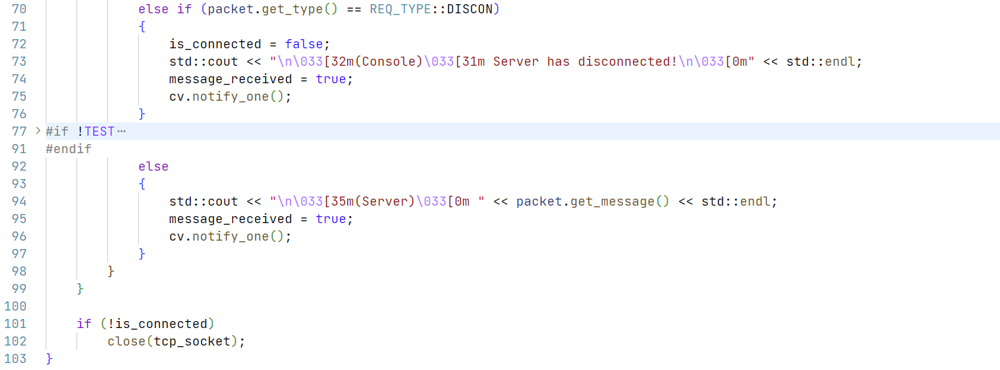

##### 五、实验数据记录和处理

- 描述请求数据包的格式（画图说明），请求类型的定义

  | (Head)PACKET        |
  | ------------------- |
  | int type            |
  | int id              |
  | string message      |
  | **(Tail)TAIL_FLAG** |

- 描述响应数据包的格式（画图说明），响应类型的定义

  | (Head)PACKET        |
  | ------------------- |
  | int type            |
  | int id              |
  | string message      |
  | **(Tail)TAIL_FLAG** |

- 描述指示数据包的格式（画图说明），指示类型的定义

  | (Head)PACKET        |
  | ------------------- |
  | int type            |
  | int id              |
  | string message      |
  | **(Tail)TAIL_FLAG** |

- 客户端初始运行后显示的菜单选项

  未连接时：

  

  连接后：

  

- 客户端的主线程循环关键代码截图（描述总体，省略细节部分）

  

  

  

  

- 客户端的接收数据子线程循环关键代码截图（描述总体，省略细节部分）

  

  

- 服务器初始运行后显示的界面

  

- 服务器的主线程循环关键代码截图（描述总体，省略细节部分）

  

- 服务器的客户端处理子线程循环关键代码截图（描述总体，省略细节部分）

  

  

  

- 客户端选择连接功能时，客户端和服务端显示内容截图

  

  Wireshark抓取的数据包截图：

  

- 客户端选择获取时间功能时，客户端和服务端显示内容截图

  

  Wireshark抓取的数据包截图（展开应用层数据包，标记请求、响应类型、返回的时间数据对应的位置）：

   

  相关的服务器的处理代码片段：

  

- 客户端选择获取名字功能时，客户端和服务端显示内容截图

  

  Wireshark抓取的数据包截图（展开应用层数据包，标记请求、响应类型、返回的名字数据对应的位置）：

  

  相关的服务器的处理代码片段：

  

- 客户端选择获取客户端列表功能时，客户端和服务端显示内容截图

  

  Wireshark抓取的数据包截图（展开应用层数据包，标记请求、响应类型、返回的客户端列表数据对应的位置）：

  

  相关的服务器的处理代码片段：

  

  

- 客户端选择发送消息功能时，客户端和服务端显示内容截图

  发送消息的客户端：

  

  服务器：

  

  接收消息的客户端：

  

  Wireshark抓取的数据包截图（发送和接收分别标记）：

  

  相关的服务器的处理代码片段：

  

  相关的客户端（发送和接收消息）处理代码片段：

  接收：

  

  发送：

  

- 拔掉客户端的网线，然后退出客户端程序。观察客户端的TCP连接状态，并使用Wireshark观察客户端是否发出了TCP连接释放的消息。同时观察服务端的TCP连接状态在较长时间内（10分钟以上）是否发生变化。

- 再次连上客户端的网线，重新运行客户端程序。选择连接功能，连上后选择获取客户端列表功能，查看之前异常退出的连接是否还在。选择给这个之前异常退出的客户端连接发送消息，出现了什么情况？

- 修改获取时间功能，改为用户选择1次，程序内自动发送100次请求。服务器是否正常处理了100次请求，截取客户端收到的响应（通过程序计数一下是否有100个响应回来），并使用Wireshark抓取数据包，观察实际发出的数据包个数。

  运行截图：

  

  Wireshark：

  

- 多个客户端同时连接服务器，同时发送时间请求（程序内自动连续调用100次send），服务器和客户端的运行截图

  运行截图：

  